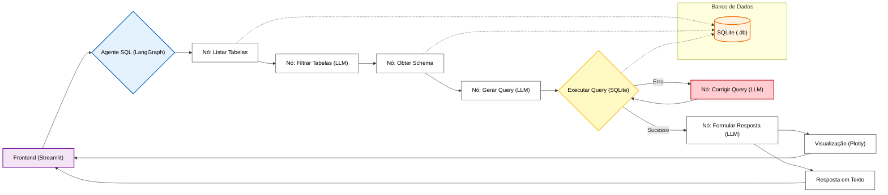

# Assistente Virtual de Dados (NL2SQL)

> Solução para o Desafio Técnico 1: Engenharia de IA
> Agente autônomo de análise de dados com capacidade de auto-correção, otimização de contexto e visualização dinâmica.

---

## 🎯 Visão Geral

Este projeto implementa um **Assistente de Dados Inteligente** que converte perguntas em linguagem natural (Português) em consultas SQL, executa-as em um banco de dados e apresenta os resultados com visualizações gráficas interativas.

Diferente de abordagens simples (RAG padrão ou Chains lineares), esta solução utiliza uma **Arquitetura de Agentes Cíclica (LangGraph)**. Isso permite que o sistema identifique erros de SQL e se auto-corrija antes de responder ao usuário, além de otimizar o uso de tokens filtrando o contexto do banco de dados.

### ✨ Funcionalidades Principais

* **🗣️ Natural Language to SQL (NL2SQL):** Converte perguntas complexas em SQL preciso.
* **🔄 Auto-Correção de Erros:** Se a query falhar (ex: erro de sintaxe), o agente lê o erro, ajusta a query e tenta novamente (loop de feedback).
* **📉 Otimização de Contexto (Granularidade):** O agente seleciona apenas as tabelas relevantes para a pergunta antes de carregar o schema, economizando tokens em bancos grandes.
* **🧠 Transparência (White-box):** Exibe o "raciocínio" do modelo, a query gerada e as tabelas selecionadas via UI.
* **📊 Visualização Inteligente:** Detecta automaticamente o tipo de dado e plota o gráfico mais adequado (Linhas, Barras, Pizza) usando Plotly, evitando erros comuns de plotagem.

---

## 🏗️ Arquitetura

O sistema é composto por três camadas principais orquestradas pelo LangGraph:

### Fluxo do Agente (StateGraph)

O agente opera como uma Máquina de Estados Finitos com loops de correção:

```mermaid
graph LR
    Start([Início]) --> List[🕵️ Listar Tabelas]
    List --> Filter{Precisa Filtrar?}
    
    Filter -- Sim --> FilterAction[🔍 Filtrar Tabelas Relevantes]
    Filter -- Não --> Schema
    FilterAction --> Schema[📝 Carregar Schema]
    
    Schema --> Generate[🧠 Gerar SQL]
    Generate --> Execute[⚡ Executar SQL]
    
    Execute -- Erro --> Correct[🔧 Corrigir Query]
    Correct -- Tenta Novamente --> Execute
    
    Execute -- Sucesso --> Response[🗣️ Formular Resposta]
    Response --> End([Fim])
    
    %% Estilização
    style Start fill:#E8F5E9,stroke:#2E7D32,stroke-width:2px,color:#000
    style End fill:#E8F5E9,stroke:#2E7D32,stroke-width:2px,color:#000
    
    style List fill:#E3F2FD,stroke:#1565C0,stroke-width:2px,color:#000
    style Schema fill:#E3F2FD,stroke:#1565C0,stroke-width:2px,color:#000
    style Generate fill:#E3F2FD,stroke:#1565C0,stroke-width:2px,color:#000
    style FilterAction fill:#E3F2FD,stroke:#1565C0,stroke-width:2px,color:#000
    style Response fill:#E3F2FD,stroke:#1565C0,stroke-width:2px,color:#000
    
    style Filter fill:#FFF9C4,stroke:#FBC02D,stroke-width:2px,color:#000
    style Execute fill:#FFF9C4,stroke:#FBC02D,stroke-width:2px,color:#000
    
    style Correct fill:#FFCDD2,stroke:#C62828,stroke-width:2px,stroke-dasharray: 5 5,color:#000
```



### Diagrama de Arquitetura


---

## 🚀 Como Executar

### Pré-requisitos
- Python 3.10 ou superior
- Chave de API (OpenAI ou Google Gemini)

### Instalação

1. Clone o repositório:
   git clone https://github.com/MarceloCMAmaral/assistente-virtual-dados-sql.git
   cd assistente-virtual-dados

2. Crie um ambiente virtual:
   # Windows
   python -m venv venv
   venv\Scripts\activate
   
   # Linux/Mac
   python -m venv venv
   source venv/bin/activate

3. Instale as dependências:
   pip install -r requirements.txt

4. Configure as variáveis de ambiente:
   Copie o exemplo:
   cp .env.example .env
   
   Edite o arquivo .env e insira sua chave (OPENAI_API_KEY ou GOOGLE_API_KEY) e escolha o provider (openai ou gemini).

5. Execute a aplicação:
   streamlit run app.py

A aplicação estará disponível em http://localhost:8501

---

## 💡 Diferenciais Técnicos (Por que LangGraph?)

Durante o desenvolvimento, a arquitetura de Agentes (LangGraph) foi escolhida em detrimento de Chains lineares pelos seguintes motivos:

1. **Resiliência (Auto-correção):**
   LLMs podem alucinar sintaxe SQL. O nó de correção permite que o agente aprenda com o erro de execução e tente novamente, garantindo robustez.

2. **Controle Granular de Contexto (Nó de Filtro):**
   Em vez de injetar o schema do banco inteiro no prompt (o que é caro e confuso para o LLM em bancos grandes), implementei um nó intermediário que seleciona apenas as tabelas relevantes antes de pedir o schema.

3. **Visualização "Data-Aware":**
   O módulo de gráficos contém heurísticas para tratar séries temporais corretamente, agrupando dados por categorias e evitando gráficos quebrados.

---

## 📂 Estrutura de Arquivos

```text
assistente-virtual-dados/
├── app.py                    # Frontend Streamlit
├── requirements.txt          # Dependências
├── anexo_desafio_1.db        # Banco de Dados SQLite
├── .env                      # Variáveis de Ambiente
└── src/
    ├── config.py             # Configurações Globais
    ├── agent/
    │   ├── sql_agent.py      # Grafo LangGraph (Nodes & Edges)
    │   ├── prompts.py        # Prompts do Sistema e Filtros
    │   └── llm.py            # Configuração dos Modelos
    ├── database/
    │   └── connection.py     # Gestão da Conexão (Singleton)
    └── visualization/
        └── charts.py         # Geração de Gráficos Plotly
```

---

## Exemplos de Consultas

### Consultas Testadas

| Pergunta | Descricao |
|----------|-----------|
| "Quantos clientes existem no banco?" | Retorna contagem total de clientes |
| "Liste os 5 estados com mais clientes" | Ranking de estados por numero de clientes |
| "Qual o valor total de compras por categoria?" | Agregacao por categoria com grafico |
| "Quantas reclamacoes nao foram resolvidas?" | Filtro por status de resolucao |
| "Qual o ticket medio por canal de venda?" | Calculo de media agrupado |
| "Quais clientes compraram mais de 5 vezes?" | Filtro por frequencia de compra |

### Tipos de Visualizacao

O sistema detecta automaticamente o melhor tipo de grafico:

- **Grafico de Barras**: Dados categoricos com valores numericos (ate 15 itens)
- **Grafico de Pizza**: Distribuicoes simples (ate 6 itens)
- **Grafico de Linha**: Series temporais
- **Histograma**: Distribuicao de valores numericos
- **Tabela**: Fallback para dados complexos

---

## Sugestoes de Melhorias

### Mais Importates para UX

Mesmo que a versão atual atenda a todos os requisitos funcionais elecandos no desafio, acredito que existem pontos chave para evoluir a robustez do sistema em produção:

1. **Memória Conversacional (contexto)**
   - Problema: Atualmente o agente trata cada interação de forma isolada.
   - Solução Proposta: Implementar persistência de estado no SQLAgentState mantendo uma janela deslizante das últimas interações (ex: HumanMessage e AIMessage). Isso permitiria uma conversa, de fato, com o agente. Ex: "Desses clientes listados, quantos são de SP?".

2. **Guardrails de Segurança**
   - Problema: Dependência exclusiva do prompt do sistema para evitar comandos DML (DELETE, DROP).
   - Solução Proposta: Adicionar um middleware antes da execução da query. Utilizando uma análise léxica ou regex para bloquear prompts destrutitivos, garantindo que mesmo em caso de "jailbreak" do LLM, o banco permaneça íntegro.

3. **Testes Automatizados**
   - Problema: Garantia manual de qualidade.
   - Solução Proposta: Implementar testes unitários com pytest focados nas funções determinísticas (ex: detect_visualization_type em charts.py) e testes de integração para o fluxo do grafo (mockando a chamada ao LLM para testar apenas a lógica de roteamento do LangGraph).

### Curto Prazo

1. **Cache de Respostas**: Implementar cache para consultas repetidas usando Redis ou SQLite.

2. **Persistencia de Historico**: Salvar historico de conversas em banco de dados para retomada posterior.

3. **Validacao de SQL**: Adicionar camada de validacao para prevenir injecao de SQL e queries destrutivas.

4. **Testes Automatizados**: Implementar testes unitarios para o agente e visualizacoes.

### Medio Prazo

5. **API REST**: Expor funcionalidade via FastAPI para integracao com outros sistemas.

6. **Multiplos Bancos**: Suportar conexao com PostgreSQL, MySQL alem de SQLite.

7. **Modo Socratico**: Adicionar modo onde o assistente faz perguntas clarificadoras antes de executar queries complexas.

### Longo Prazo

9. **RAG com Documentacao**: Integrar documentacao do schema para respostas mais contextualizadas.

10. **Dashboards Automaticos**: Gerar dashboards automaticos baseados em perguntas frequentes.

11. **Multi-tenant**: Suportar multiplos usuarios com bancos de dados isolados.

---

## Banco de Dados

O banco SQLite (`anexo_desafio_1.db`) contem as seguintes tabelas:

| Tabela | Colunas |
|--------|---------|
| clientes | id, nome, email, idade, cidade, estado, profissao, genero |
| compras | id, cliente_id, data_compra, valor, categoria, canal |
| suporte | id, cliente_id, data_contato, tipo_contato, resolvido, canal |
| campanhas_marketing | id, cliente_id, nome_campanha, data_envio, canal, interagiu |

---

## Licenca

Este projeto foi desenvolvido como parte de um desafio tecnico.
